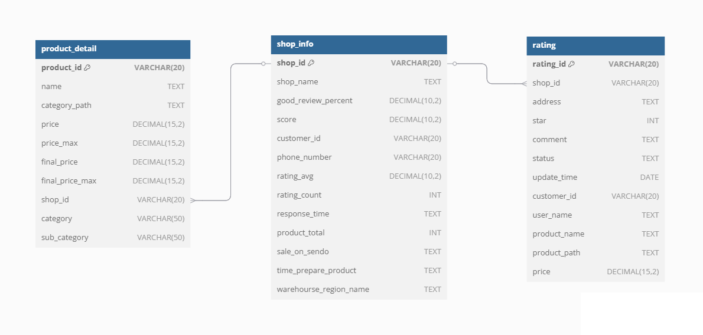

# ETL Sendo Webscrapping
## Required
- Python
- Docker
- Docker compose
## Data warehouse

- Shop info: This table contains shop information
- Product detail: This table contains detailed information about the products
- Rating: This board contains shop reviews
## Data pipeline

## To use
- Install all requirement library
```bash
pip install -r requirements.txt
```
- Start docker
```bash
docker compose up -d
```
- Stop docker
```bash
docker compose down
```
- Airflow:
    - Url: [http://localhost:8080](http://localhost:8080)
    - Username: airflow
    - Password: airflow
- MySQL
    - Ip: localhost
    - Port: 3306
    - Username: sendo
    - Password: sendo
    - Database: sendo